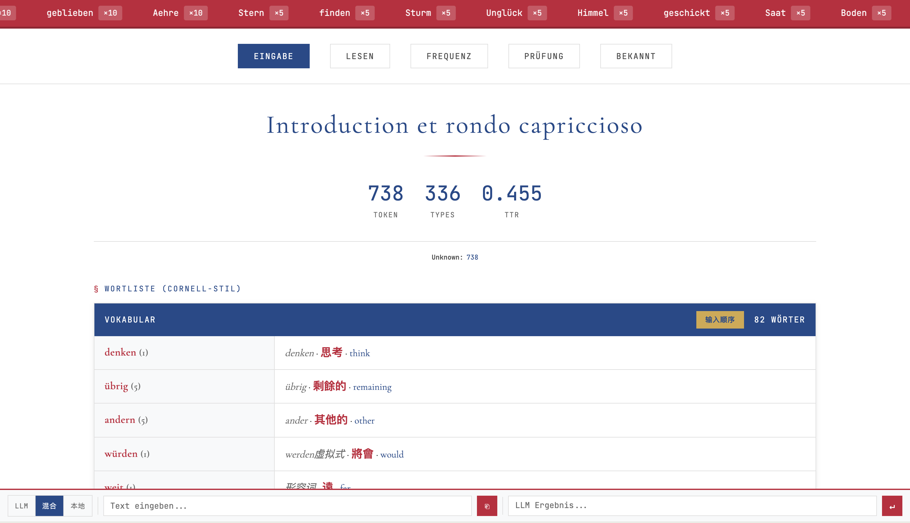
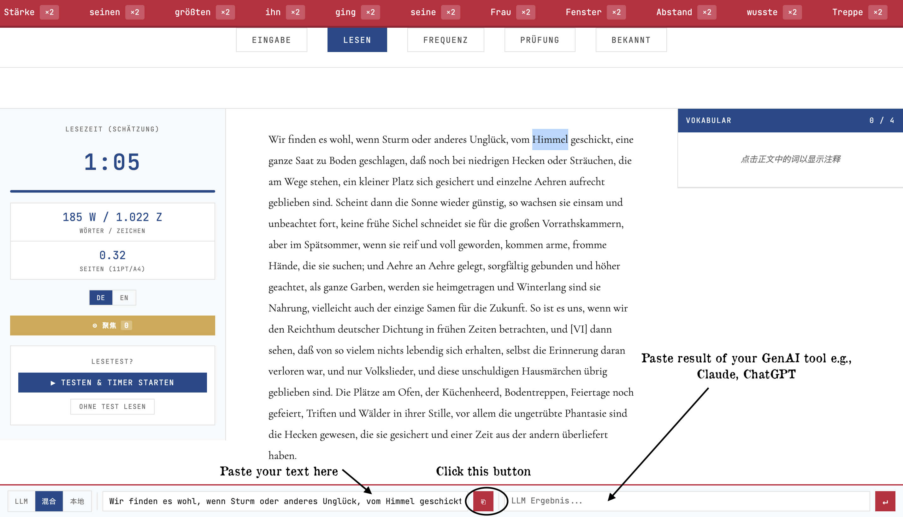
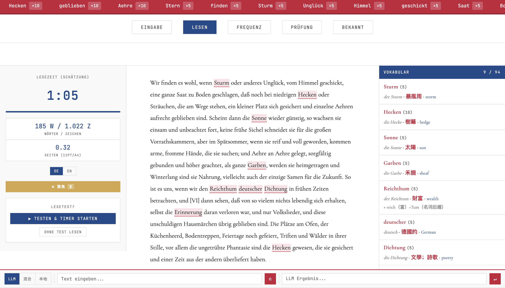
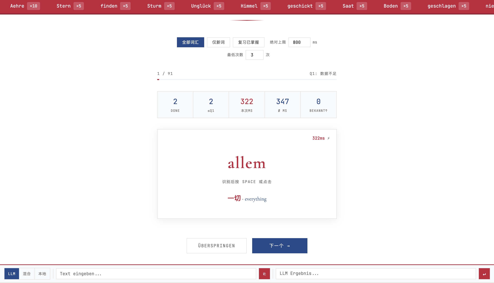

# Fuga 26 Nördlingen

德語閱讀詞彙工具：貼上原文 → 分詞 → 查詞庫或呼叫本地 LLM 註釋 → 追蹤詞頻、以反應時間排閃卡 → 匯出成電子閱讀器詞典。附一個瀏覽器選詞擴展。

> 正式標題取自 Saint-Saëns, Op. 28 — *Introduction et rondo capriccioso*。
> 發行名採「年份 + 地名」：`Fuga <西元年後兩位> <地名>`。
> 介面與程式碼內部一律用 `Fuga`，正式標題只出現在視窗標題列。

---

## 安裝與使用

### 共通前置

| 項目 | 需求 | 備註 |
|---|---|---|
| Python | 3.8+ | `server.py` 只用標準庫，**沒有任何第三方依賴** |
| Ollama | 可選 | 只有「Ollama 模式」和擴展的「⚡ 生成」按鈕需要 |
| 模型 | `qwen2.5:7b` | 寫死在 `server.py` 的 `OLLAMA_MODEL`；想更快可換 `qwen2.5:3b` |

裝 Ollama 與模型：

```bash
ollama pull qwen2.5:7b
```

### macOS

```bash
cd ~/Documents/MyApp/fugaD
python3 server.py
```

然後瀏覽器開 `http://localhost:8765`。

桌面上的 `.command` 啟動器可雙擊執行，它會先清掉佔用埠號的舊行程、啟動伺服器、等就緒後自動開瀏覽器；關掉視窗即停止伺服器。腳本內硬編碼了 `APP_DIR`，搬動專案目錄後要同步改。

### Windows

```bat
cd C:\path\to\fugaD
py server.py
```

同樣開 `http://localhost:8765`。若 `py` 不存在，改用 `python`（安裝 Python 時記得勾選 *Add python.exe to PATH*）。

想要雙擊啟動，把下面存成 `start.bat` 放在專案目錄：

```bat
@echo off
cd /d "%~dp0"
start "" http://localhost:8765
py server.py
pause
```

### Linux

看得懂上面兩段就會了，不另外寫。

---

## 已知平台限制

**Tolino／Kobo 詞典匯出（底部工具列的「辞」鈕）目前只能在 macOS + Anaconda 環境下運作。** 兩處硬編碼：

| 位置 | 內容 | Windows 上的問題 |
|---|---|---|
| `build_quickdic.py` 第 1 行 | `#!/opt/anaconda3/bin/python` | 路徑不存在 |
| `build_quickdic.py` `TMP_DIR` | `/tmp/fuga_kobo_build` | 應改用 `tempfile.gettempdir()` |
| `server.py` `/api/build-dict` | 同樣寫死 Anaconda 路徑 | 同上 |

此功能另需 `pip install pyglossary marisa-trie`，其中 `pyicu` 在 Windows 上不易安裝。**除此之外**（伺服器、網頁介面、Ollama 模式、瀏覽器擴展）在 Windows 上都正常。

---

## AI 聲明

本專案在開發過程中大量借助 Claude 撰寫程式碼。

其中瀏覽器選詞擴展 `extension/`、`server.py` 的 `/api/lookup`、`/api/translate`、`/api/pending` 端點與執行緒化改造、`index.html` 的待處理佇列回流邏輯，以及本安裝說明，由 **Claude Opus 5**（Anthropic）撰寫。

`vocab_db.json` 為個人詞庫，已在 `.gitignore` 中排除，不隨本倉庫發布。

---

## 本次改動摘要

### 1. 外部詞彙資料庫 `vocab_db.json`

新增一個獨立的 JSON 檔案作為持久化詞庫，結構如下：

```json
{
  "version": "1.0",
  "vocab": {
    "Entwicklung": { "zh": "發展", "en": "development", "lemma": "die Entwicklung" }
  }
}
```

每當 LLM 結果被解析後，新詞條會自動寫入此檔案，跨 session 永久保留。

---

### 2. 本地伺服器 `server.py`

由於瀏覽器的安全限制，純 HTML 檔案無法直接讀寫本地檔案。因此改為以 Python 啟動一個 localhost 伺服器，提供兩個功能：

- **靜態檔案服務**：提供 `index.html` 等頁面
- **API 端點**：
  - `GET /api/db` — 讀取詞庫
  - `POST /api/db` — 合併新詞條寫入詞庫

---

### 3. 三種翻譯模式（`index.html`）

在底部工具列新增了模式切換按鈕：

| 模式 | 行為 |
|---|---|
| **LLM** | 原有流程不變——所有篩選後的 token 全數複製為提示詞，LLM 結果解析後同步更新詞庫 |
| **混合** | 詞庫中已有的詞條直接顯示；尚未收錄的才匯出至提示詞交由 LLM 處理，結果回傳後兩者合併顯示 |
| **本地** | 僅查閱詞庫，完全不涉及 LLM，無複製提示詞步驟，LLM 輸入欄也會自動隱藏 |

---

### 4. 快速啟動腳本 `~/Desktop/FugaVocabs.command`

桌面上新增一個可雙擊執行的 `.command` 程式：

1. 終止舊有的同埠程序（如已在運行）
2. 啟動 `server.py`
3. 等待伺服器就緒後，自動以預設瀏覽器開啟 `http://localhost:8765`
4. 關閉視窗即停止伺服器

---

### 5. Tolino 詞典轉換腳本 `build_quickdic.py`

更新 build_quickdic.py
將腳本從 QuickDic 格式改為 Kobo dicthtml 格式，流程是：

讀取 vocab_db.json
用 pyglossary 產生 Kobo 格式目錄（含 gzip 壓縮的 HTML + marisa-trie 索引）
將目錄打包成 dicthtml-de-zht.zip（不壓縮存儲，與官方格式一致）
輸出轉移指令
將詞典載入閱讀器的對應 目錄：`~/.kobo/custom-dict`

使用方式：
build_quickdic.py 的 shebang 行已指定直接使用 Anaconda 的 Python，因此最簡單的方式是：

方法一：直接執行（推薦）

`/opt/anaconda3/bin/python /Users/ayano/Documents/MyApp/fugaD/build_quickdic.py`
方法二：因為已 chmod +x，可直接呼叫

`/Users/ayano/Documents/MyApp/fugaD/build_quickdic.py`

系統的 python3（`/usr/bin/python3`）不可用，因為 pyicu 只裝在 Anaconda 環境裡，缺少它會報錯。


---

### 6. 瀏覽器選詞擴展 `extension/`

一個 Manifest V3 擴展（Vivaldi / Chrome / Edge / Brave）：在任意網頁上選中德語詞，
頁面側邊彈出獨立小窗口顯示詞庫註釋，排版與 LESEN 頁右欄一致；詞庫未收錄的詞可
一鍵交給本地 Ollama 生成並入庫。查過的詞會經由 `pending_queue.json` 回流到主應用的
詞頻與 Prüfung 閃卡池。

安裝與細節見 [extension/README.md](extension/README.md)。

`server.py` 為此新增了四個端點：`GET /api/lookup`、`POST /api/translate`、
`POST /api/pending`、`GET /api/pending?drain=1`，並改用 `ThreadingHTTPServer`，
避免一次 Ollama 生成把整個伺服器堵住。

## 截圖



Get start.




Anki quiz based on responsing time.


